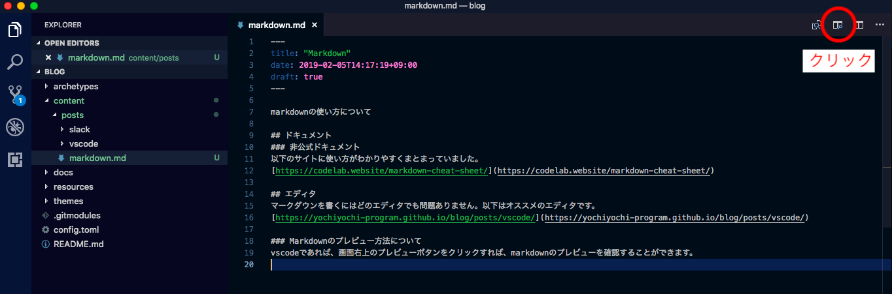
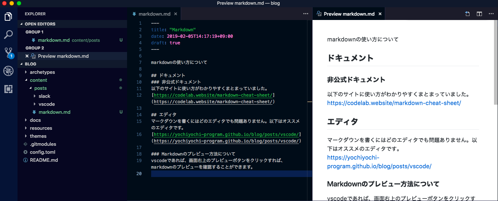

markdownの使い方について

## ドキュメント
### 非公式ドキュメント
以下のサイトに使い方がわかりやすくまとまっていました。
[https://codelab.website/markdown-cheat-sheet/](https://codelab.website/markdown-cheat-sheet/)

## エディタ
マークダウンを書くにはどのエディタでも問題ありません。以下はオススメのエディタです。  
[https://yochiyochi-program.github.io/blog/posts/vscode/](https://yochiyochi-program.github.io/blog/posts/vscode/)

### Markdownのプレビュー方法について
vscodeであれば、以下の手順でmarkdownのプレビューを確認することができます。

1. 画面の右上のアイコンをクリック

2. プレビューを確認  
画面の左側がmarkdownで、右側がそのプレビューです。

