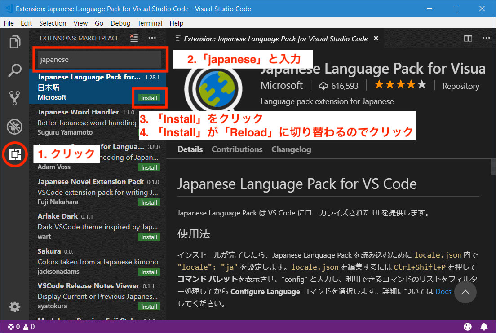
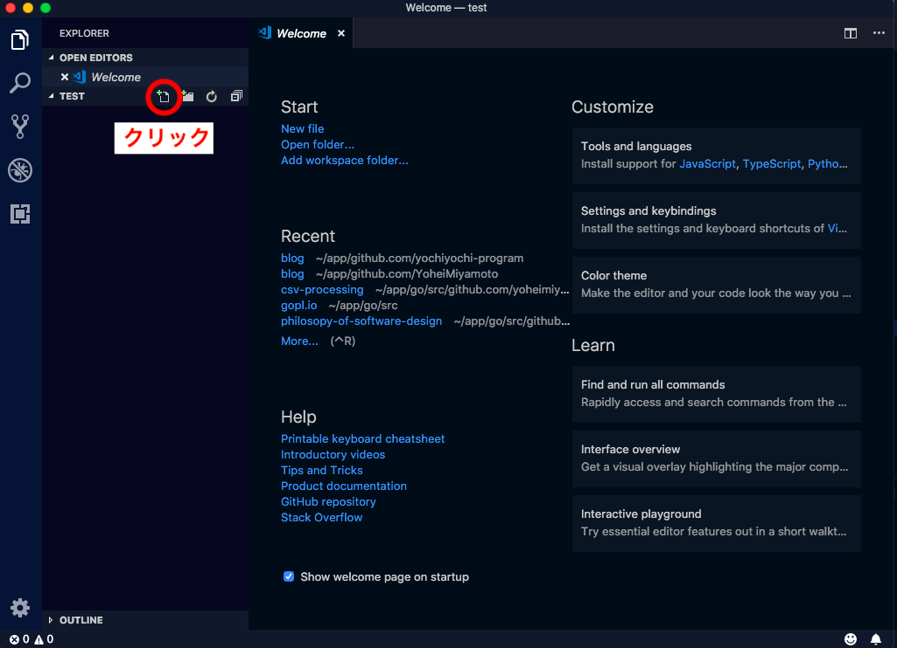
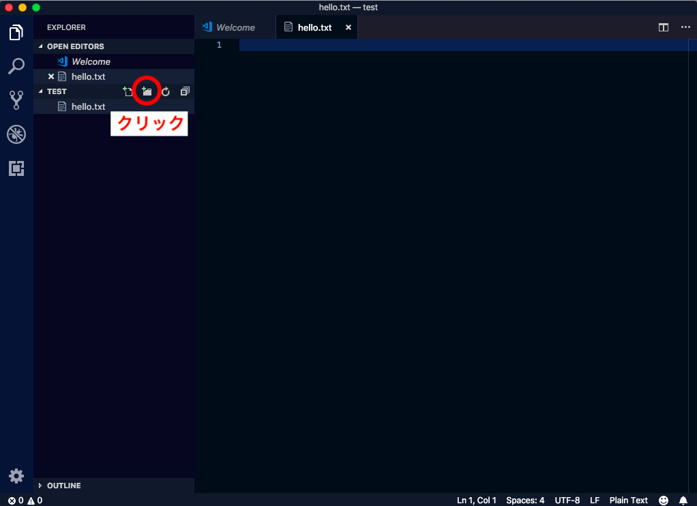
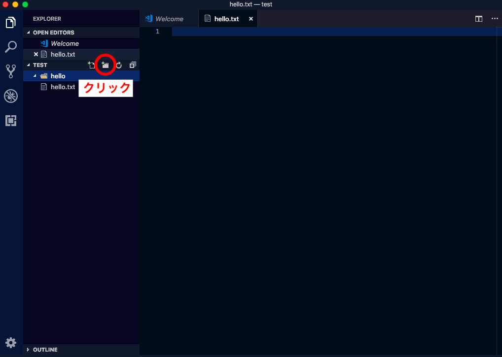

開発用エディタのVisual Studio Code のインストール方法です。
Visual Studio Code（通称： vscode）は、マイクロソフトが開発しているエディタです。  

## インストール
以下のリンクからアプリをダウンロード。  
[公式ページ](https://code.visualstudio.com/)

----

## 日本語に切り替え
初期設定は英語なので日本語に切り替えたいかは以下の手順で切り替えます。

- 1. extensions（機能拡張）の画面を開く
- 2. 日本語のextensionsを検索しダウンロードする
- 3. ダウンロード完了後。「Reload」をクリックする

----

## 便利なライブラリインストール
同様の方法で以下のextensionsをダウンロード。
他にも様々な便利なextensionsがありますのでいろいろと試してみてください。

### vscode-icons
各ファイルの横にファイルの種類が判別しやすいロゴが表示される。
見た目もかわいい。

### HTML Snippets
HTMLの入力補完機能。 コーディングが楽になる。

----

## 使ってみる
### 1. 作業用のフォルダを開く
Menu > File > Open  
をクリックしてフォルダを選択。必要に応じて新規フォルダを作成することもできます。

### 2. ファイルを作成
ファイル作成のアイコンをクリックしてファイルを作成します。

### 3. フォルダを作成
フォルダ作成のアイコンをクリックしてファイルを作成します。

### 4. フォルダの中にファイルを作成
対象のフォルダ名をクリックしてからファイル作成アイコンをクリックします。

----

## まとめ
これでエディタのインストールは完了です。 このエディタは開発だけでなくメモ帳などとしても使えますのでいろいろと活用してみてください。